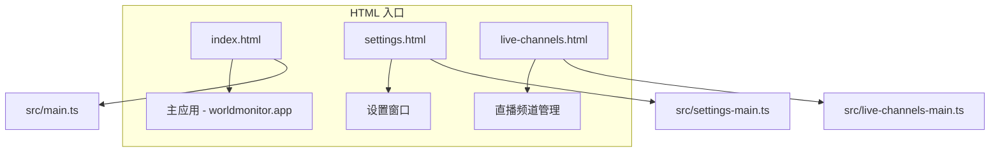
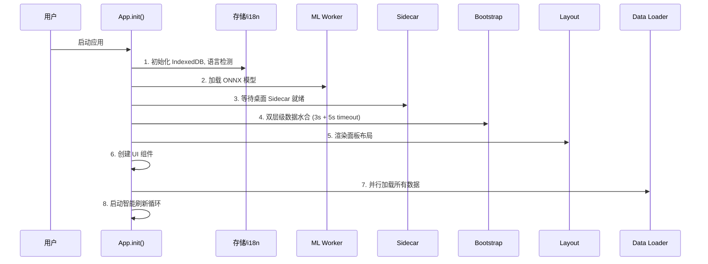
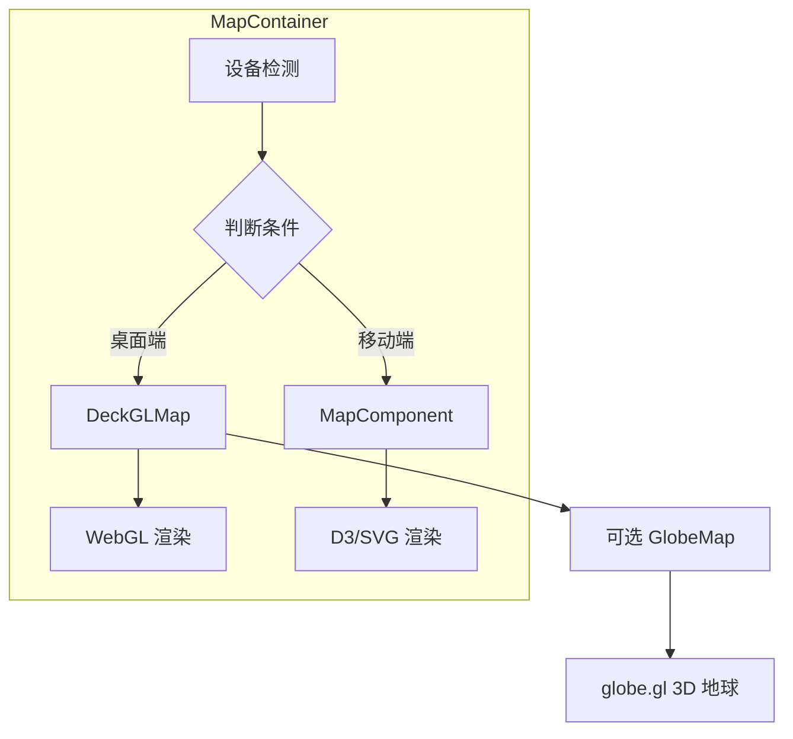
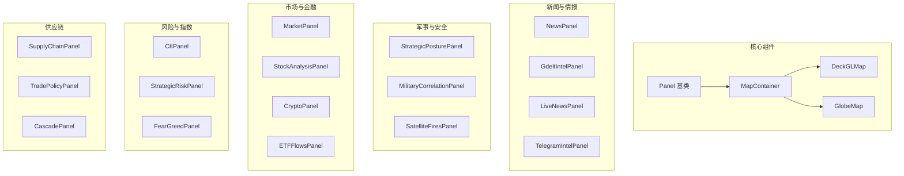

# World Monitor 前端页面架构分析报告

> 分析日期：2026-03-25
> 项目版本：v2.6.5
> 文档状态：草稿

---

## 目录

1. [前端入口文件](#1-前端入口文件)
2. [应用初始化流程](#2-应用初始化流程)
3. [核心状态管理](#3-核心状态管理)
4. [面板系统架构](#4-面板系统架构)
5. [双地图系统](#5-双地图系统)
6. [组件分类总览](#6-组件分类总览)
7. [配置系统](#7-配置系统)
8. [变体系统](#8-变体系统)
9. [样式与主题](#9-样式与主题)
10. [前端目录结构](#10-前端目录结构)

---

## 1. 前端入口文件

### 1.1 HTML 入口文件

项目包含三个独立的 HTML 入口：



| 入口文件 | 入口脚本 | 用途 |
|----------|----------|------|
| `index.html` | `/src/main.ts` | 主应用仪表盘 |
| `settings.html` | `/src/settings-main.ts` | 设置窗口 |
| `live-channels.html` | `/src/live-channels-main.ts` | YouTube 直播频道管理 |

### 1.2 主入口 index.html 分析

```html
<!-- 关键特性 -->
1. 预渲染骨架屏 (Skeleton Shell)
   - 在 JavaScript 加载前显示加载状态
   - 支持暗色/亮色/happy 变体主题

2. 内容安全策略 (CSP)
   - 定义严格的脚本、样式、连接来源
   - Worker-src、frame-src 等详细配置

3. 结构化数据 (JSON-LD)
   - WebApplication 类型
   - 包含功能列表、作者信息

4. 多语言 hreflang 链接
   - 支持 21 种语言版本
```

---

## 2. 应用初始化流程

### 2.1 App.init() 8 阶段初始化

`src/App.ts` 中的 `App.init()` 方法按顺序执行 8 个阶段：



### 2.2 初始化核心代码结构

```typescript
// src/App.ts
export class App {
  private panelLayout: PanelLayoutManager;      // 面板布局管理
  private dataLoader: DataLoaderManager;        // 数据加载管理
  private eventHandlers: EventHandlerManager;  // 事件处理管理
  private searchManager: SearchManager;         // 搜索管理
  private countryIntel: CountryIntelManager;      // 国家情报管理
  private refreshScheduler: RefreshScheduler;    // 刷新调度器
  private desktopUpdater: DesktopUpdater;        // 桌面更新器
}
```

---

## 3. 核心状态管理

### 3.1 AppContext - 中心化状态对象

项目采用**不使用外部状态库**的设计，使用 `AppContext` 中心化可变对象：

```typescript
// src/app/app-context.ts
export interface AppContext {
  // 地图引用
  map: MapContainer | null;

  // 面板实例
  panels: Record<string, Panel>;
  newsPanels: Record<string, NewsPanel>;
  panelSettings: Record<string, PanelConfig>;

  // 地图图层状态
  mapLayers: MapLayers;

  // 缓存数据
  allNews: NewsItem[];
  newsByCategory: Record<string, NewsItem[]>;
  latestMarkets: MarketData[];
  latestPredictions: PredictionMarket[];
  latestClusters: ClusteredEvent[];
  intelligenceCache: IntelligenceCache;

  // UI 组件引用
  signalModal: SignalModal | null;
  statusPanel: StatusPanel | null;
  searchModal: SearchModal | null;
  breakingBanner: BreakingNewsBanner | null;

  // 状态标志
  isDestroyed: boolean;
  isPlaybackMode: boolean;
  isIdle: boolean;
  initialLoadComplete: boolean;

  // 位置
  resolvedLocation: 'global' | 'america' | 'mena' | 'eu' | 'asia' | 'latam' | 'africa' | 'oceania';
}
```

### 3.2 IntelligenceCache 接口

```typescript
export interface IntelligenceCache {
  flightDelays?: AirportDelayAlert[];          // 航班延误
  thermalEscalation?: ThermalEscalationWatch;   // 热异常升级
  aircraftPositions?: PositionSample[];          // 飞机位置
  outages?: InternetOutage[];                    // 互联网中断
  protests?: SocialUnrestEvent[];                // 抗议活动
  military?: MilitaryData;                        // 军事数据
  earthquakes?: Earthquake[];                     // 地震
  usniFleet?: USNIFleetReport;                   // USNI 舰队报告
  iranEvents?: IranEvent[];                     // 伊朗事件
  advisories?: SecurityAdvisory[];               // 安全公告
  sanctions?: SanctionsPressureResult;            // 制裁压力
  radiation?: RadiationWatchResult;              // 辐射监测
}
```

---

## 4. 面板系统架构

### 4.1 Panel 基类

所有面板继承自 `Panel` 基类 (`src/components/Panel.ts`)：

```typescript
export interface PanelOptions {
  id: string;           // 面板唯一标识
  title: string;         // 显示标题
  showCount?: boolean;   // 是否显示计数
  className?: string;    // CSS 类名
  trackActivity?: boolean; // 是否追踪活动
  infoTooltip?: string;  // 工具提示
  premium?: 'locked' | 'enhanced';  // 高级功能标记
  closable?: boolean;    // 是否可关闭
}
```

### 4.2 面板关键特性

| 特性 | 描述 |
|------|------|
| 可调整大小 | 支持行列跨距调整，持久化到 localStorage |
| 内容渲染 | `setContent(html)` 方法，带 150ms 防抖 |
| 事件委托 | 使用稳定 `this.content` 元素的事件监听 |
| 关闭/重置 | 支持隐藏、重置到默认布局 |

### 4.3 面板持久化存储

```typescript
// localStorage 键
const PANEL_SPANS_KEY = 'worldmonitor-panel-spans';
const PANEL_COL_SPANS_KEY = 'worldmonitor-panel-col-spans';

// 存储结构
loadPanelSpans(): Record<string, number>  // 行跨距
loadPanelColSpans(): Record<string, number> // 列跨距
```

---

## 5. 双地图系统

### 5.1 架构概览

项目实现了两种地图渲染模式的智能切换：



### 5.2 MapContainer 条件渲染

```typescript
// src/components/MapContainer.ts
export class MapContainer {
  private isMobile: boolean;
  private deckGLMap: DeckGLMap | null = null;
  private svgMap: MapComponent | null = null;
  private globeMap: GlobeMap | null = null;

  // 根据设备自动选择渲染器
  private useDeckGL: boolean = !isMobileDevice();
  private useGlobe: boolean = false;
}
```

### 5.3 DeckGLMap (桌面端)

**文件**: `src/components/DeckGLMap.ts` (5700+ 行)

支持 Deck.gl 图层：

| 图层类型 | 用途 |
|----------|------|
| `ScatterplotLayer` | 单点标记 |
| `GeoJsonLayer` | 区域多边形 |
| `PathLayer` | 路径/管道 |
| `IconLayer` | 图标标记 |
| `PolygonLayer` | 多边形区域 |
| `ArcLayer` | 弧线连接 |
| `HeatmapLayer` | 热力图 |
| `H3HexagonLayer` | H3 六边形网格 |

**性能优化**:
- Supercluster 聚类
- PMTiles 协议加载底图
- ResizeObserver 响应式调整

### 5.4 GlobeMap (3D 地球)

**文件**: `src/components/GlobeMap.ts` (3400+ 行)

**特性**:
- globe.gl + Three.js 实现
- 单一合并 `htmlElementsData` 数组
- `_kind` 判别器区分标记类型
- 空闲时自动旋转 (60s 无操作触发)
- 支持纹理、大气着色器

**支持的标记类型**:
```typescript
type MarkerKind =
  | 'conflict'    // 冲突事件
  | 'hotspot'     // 热点
  | 'flight'       // 飞机
  | 'vessel'       // 舰艇
  | 'base'         // 军事基地
  | 'nuclear'      // 核设施
  | 'cable'        // 海底电缆
  | 'pipeline'     // 管道
  // ... 更多类型
```

---

## 6. 组件分类总览

### 6.1 组件清单

项目包含 **100+** 面板组件，分为以下类别：

#### 核心组件

| 组件 | 文件 | 功能 |
|------|------|------|
| `Panel` | `Panel.ts` | 面板基类 |
| `MapContainer` | `MapContainer.ts` | 地图容器 |
| `DeckGLMap` | `DeckGLMap.ts` | WebGL 地图 |
| `GlobeMap` | `GlobeMap.ts` | 3D 地球 |
| `NewsPanel` | `NewsPanel.ts` | 新闻面板 |
| `MarketPanel` | `MarketPanel.ts` | 市场面板 |

#### 情报与安全

| 组件 | 功能 |
|------|------|
| `CIIPanel` | 国家不稳定性指数 |
| `StrategicRiskPanel` | 战略风险概览 |
| `StrategicPosturePanel` | AI 战略态势 |
| `GdeltIntelPanel` | GDELT 实时情报 |
| `TelegramIntelPanel` | Telegram 情报 |
| `SecurityAdvisoriesPanel` | 安全公告 |
| `SanctionsPressurePanel` | 制裁压力 |

#### 军事与追踪

| 组件 | 功能 |
|------|------|
| `StrategicPosturePanel` | 战略态势 |
| `MilitaryCorrelationPanel` | 军事关联 |
| `AviationCommandBar` | 航空命令栏 |
| `SatelliteFiresPanel` | 卫星火点 |
| `PizzIntIndicator` | 五角大楼披萨指数 |

#### 市场与金融

| 组件 | 功能 |
|------|------|
| `MarketPanel` | 市场概览 |
| `StockAnalysisPanel` | 股票分析 |
| `StockBacktestPanel` | 回测面板 |
| `HeatmapPanel` | 板块热力图 |
| `CryptoPanel` | 加密货币 |
| `ETFFlowsPanel` | ETF 流量 |
| `StablecoinPanel` | 稳定币 |
| `MacroSignalsPanel` | 市场雷达 |
| `FearGreedPanel` | 恐惧贪婪指数 |

#### 自然与气候

| 组件 | 功能 |
|------|------|
| `EarthquakePanel` | 地震面板 |
| `ClimateAnomalyPanel` | 气候异常 |
| `WildfirePanel` | 野火面板 |
| `RadiationWatchPanel` | 辐射监测 |
| `PopulationExposurePanel` | 人口暴露 |

#### 供应链与贸易

| 组件 | 功能 |
|------|------|
| `SupplyChainPanel` | 供应链面板 |
| `TradePolicyPanel` | 贸易政策 |
| `CascadePanel` | 级联分析 |
| `DisplacementPanel` | 流离失所 |

#### 地区特定

| 组件 | 功能 |
|------|------|
| `GulfEconomiesPanel` | 海湾经济 |
| `IsraelSirensPanel` | 以色列警报 |
| `TelegramIntelPanel` | Telegram 情报 |

#### 特殊功能

| 组件 | 功能 |
|------|------|
| `PredictionPanel` | 预测市场 |
| `InsightsPanel` | AI 洞察 |
| `LiveWebcamsPanel` | 实时摄像头 |
| `WorldClockPanel` | 世界时钟 |
| `GivingPanel` | 全球捐赠 |

### 6.2 组件导出结构

```typescript
// src/components/index.ts
export * from './Panel';
export * from './VirtualList';
export { MapComponent } from './Map';
export { DeckGLMap } from './DeckGLMap';
export { MapContainer } from './MapContainer';
export * from './NewsPanel';
export * from './MarketPanel';
// ... 100+ 更多导出
```

---

## 7. 配置系统

### 7.1 配置入口

```typescript
// src/config/index.ts
export { SITE_VARIANT } from './variant';
export { REFRESH_INTERVALS } from './variants/base';
export { DEFAULT_PANELS, ALL_PANELS } from './panels';
export { FEEDS, INTEL_SOURCES } from './feeds';
export { INTEL_HOTSPOTS, MILITARY_BASES } from './geo';
```

### 7.2 面板配置

```typescript
// src/config/panels.ts
interface PanelConfig {
  name: string;           // 显示名称
  enabled: boolean;         // 默认启用状态
  priority: number;        // 优先级
  premium?: 'locked' | 'enhanced';
}

const FULL_PANELS: Record<string, PanelConfig> = {
  map: { name: 'Global Map', enabled: true, priority: 1 },
  'live-news': { name: 'Live News', enabled: true, priority: 1 },
  insights: { name: 'AI Insights', enabled: true, priority: 1 },
  cii: { name: 'Country Instability', enabled: true, priority: 1 },
  // ... 100+ 面板配置
};
```

### 7.3 变体默认配置

```typescript
// src/config/panels.ts
const VARIANT_DEFAULTS: Record<string, {
  defaultPanels: string[];
  defaultLayers: string[];
  refreshInterval: number;
}> = {
  full: {
    defaultPanels: ['map', 'live-news', 'insights', 'cii', ...],
    defaultLayers: ['conflict', 'military', 'protests', ...],
    refreshInterval: 5 * 60 * 1000,  // 5 分钟
  },
  tech: {
    defaultPanels: ['map', 'live-news', 'tech-events', ...],
    defaultLayers: ['tech-hq', 'cloud-regions', ...],
    refreshInterval: 10 * 60 * 1000,  // 10 分钟
  },
  finance: {
    defaultPanels: ['map', 'markets', 'crypto', ...],
    defaultLayers: ['stock-exchanges', 'central-banks', ...],
    refreshInterval: 1 * 60 * 1000,   // 1 分钟
  },
  happy: {
    defaultPanels: ['map', 'positive-feed', 'conservation', ...],
    defaultLayers: ['nature', 'renewable', ...],
    refreshInterval: 30 * 60 * 1000,  // 30 分钟
  },
};
```

---

## 8. 变体系统

### 8.1 变体检测逻辑

```typescript
// src/config/variant.ts
export const SITE_VARIANT: string = (() => {
  if (typeof window === 'undefined') return buildVariant;

  // Tauri 桌面应用：从 localStorage 读取
  if (isTauri) {
    return localStorage.getItem('worldmonitor-variant') || buildVariant;
  }

  // Web：根据域名检测
  const h = location.hostname;
  if (h.startsWith('tech.')) return 'tech';
  if (h.startsWith('finance.')) return 'finance';
  if (h.startsWith('happy.')) return 'happy';
  if (h.startsWith('commodity.')) return 'commodity';

  // localhost: 从 localStorage 读取
  if (h === 'localhost') {
    return localStorage.getItem('worldmonitor-variant') || 'full';
  }

  return 'full';
})();
```

### 8.2 变体差异对照表

| 功能 | full | tech | finance | commodity | happy |
|------|------|------|---------|-----------|-------|
| 默认面板 | 情报/新闻 | 科技/AI | 市场/交易 | 大宗商品 | 正面新闻 |
| 地图主题 | 军事/冲突 | 科技生态 | 金融中心 | 供应链 | 自然保护区 |
| 刷新间隔 | 5 分钟 | 10 分钟 | 1 分钟 | 15 分钟 | 30 分钟 |
| 默认面板数 | 15+ | 12+ | 20+ | 10+ | 8+ |
| 高级功能 | 增强 | 增强 | 增强 | 增强 | 增强 |

### 8.3 变体特定配置

| 变体 | 特定组件 |
|------|----------|
| `full` | `CascadePanel`, `MilitaryCorrelationPanel`, `TelegramIntelPanel` |
| `tech` | `TechEventsPanel`, `TechReadinessPanel`, `ServiceStatusPanel` |
| `finance` | `StockAnalysisPanel`, `CryptoPanel`, `MacroSignalsPanel`, `FearGreedPanel` |
| `commodity` | `SupplyChainPanel`, `TradePolicyPanel` |
| `happy` | `PositiveNewsFeedPanel`, `ConservationPanel`, `RenewableEnergyPanel` |

---

## 9. 样式与主题

### 9.1 骨架屏 (Skeleton Shell)

index.html 中内联了骨架屏 CSS，支持三种主题变体：

```css
/* 暗色主题 (默认) */
.skeleton-shell {
  background: #0a0a0a;
  font-family: 'SF Mono', monospace;
}

/* 亮色主题 */
[data-theme="light"] .skeleton-shell {
  background: #f8f9fa;
}

/* Happy 变体 (温暖色调) */
[data-variant="happy"] .skeleton-shell {
  background: #FAFAF5;
  font-family: 'Nunito', system-ui, sans-serif;
}
```

### 9.2 主题检测与切换

```typescript
// src/utils/theme-manager.ts
export function getCurrentTheme(): 'dark' | 'light' {
  const stored = localStorage.getItem('worldmonitor-theme');
  if (stored === 'dark' || stored === 'light') return stored;

  // Happy 变体默认亮色
  if (SITE_VARIANT === 'happy') return 'light';

  // 系统偏好
  if (window.matchMedia('(prefers-color-scheme: light)').matches) return 'light';
  return 'dark';
}
```

### 9.3 CSS 变量系统

项目使用 CSS 变量实现主题切换：

```css
:root {
  --bg-primary: #0a0a0a;
  --bg-secondary: #141414;
  --text-primary: #e8eaed;
  --accent: #00c853;
}

[data-theme="light"] {
  --bg-primary: #f8f9fa;
  --bg-secondary: #ffffff;
  --text-primary: #1a1a1a;
  --accent: #008f00;
}
```

---

## 10. 前端目录结构

```
src/
├── main.ts                    # 主应用入口
├── settings-main.ts          # 设置窗口入口
├── live-channels-main.ts     # 直播频道入口
├── App.ts                   # 主应用类
├── vite-env.d.ts             # Vite 类型定义
│
├── app/                     # 应用编排管理器
│   ├── app-context.ts       # 全局状态上下文
│   ├── panel-layout.ts      # 面板布局管理
│   ├── data-loader.ts       # 数据加载管理
│   ├── refresh-scheduler.ts # 刷新调度
│   ├── search-manager.ts    # 搜索管理
│   ├── country-intel.ts     # 国家情报管理
│   ├── event-handlers.ts    # 事件处理
│   └── desktop-updater.ts   # 桌面更新器
│
├── components/              # UI 组件 (100+)
│   ├── Panel.ts            # 面板基类
│   ├── MapContainer.ts     # 地图容器
│   ├── DeckGLMap.ts       # WebGL 地图
│   ├── GlobeMap.ts        # 3D 地球
│   ├── MapPopup.ts        # 地图弹出框
│   ├── NewsPanel.ts       # 新闻面板
│   ├── MarketPanel.ts     # 市场面板
│   ├── CIIPanel.ts       # 不稳定性指数
│   ├── StrategicRiskPanel.ts
│   ├── StrategicPosturePanel.ts
│   ├── SignalModal.ts      # 信号模态框
│   ├── SearchModal.ts     # 搜索模态框
│   ├── UnifiedSettings.ts # 统一设置
│   ├── BreakingNewsBanner.ts
│   └── [100+ 更多面板组件]
│
├── services/               # 业务逻辑服务
│   ├── rss.ts            # RSS 采集
│   ├── signal-aggregator.ts # 信号聚合
│   ├── summarization.ts   # AI 摘要
│   ├── ml-worker.ts       # ML Worker 接口
│   ├── bootstrap.ts       # 数据水合
│   ├── rpc-client.ts      # RPC 客户端
│   ├── persistent-cache.ts # 持久化缓存
│   ├── i18n.ts           # 国际化
│   └── [100+ 更多服务]
│
├── config/                # 配置
│   ├── index.ts          # 配置导出
│   ├── variant.ts        # 变体检测
│   ├── panels.ts         # 面板配置
│   ├── feeds.ts          # 数据源配置
│   ├── geo.ts            # 地理数据
│   ├── markets.ts        # 市场配置
│   ├── basemap.ts        # 底图配置
│   ├── map-layer-definitions.ts # 图层定义
│   └── [20+ 更多配置]
│
├── workers/               # Web Workers
│   ├── ml.worker.ts      # ONNX ML 推理
│   ├── analysis.worker.ts # 新闻聚类分析
│   └── vector-db.ts     # 向量数据库
│
├── utils/                # 工具函数
│   ├── index.ts
│   ├── dom-utils.ts      # DOM 操作
│   ├── theme-manager.ts  # 主题管理
│   ├── urlState.ts       # URL 状态同步
│   ├── sanitize.ts      # HTML 清理
│   └── [30+ 更多工具]
│
├── types/                # 类型定义
│   └── index.ts         # 全局类型
│
├── locales/              # 翻译文件 (21 种语言)
│   ├── zh.json
│   ├── en.json
│   ├── ar.json          # RTL 支持
│   └── [18+ 更多]
│
├── styles/               # 样式文件
│   ├── base-layer.css
│   └── happy-theme.css
│
├── generated/            # 生成的代码
│   ├── client/          # RPC 客户端存根
│   └── server/          # 服务端消息类型
│
└── shims/               # Node.js 兼容垫片
    └── child-process.ts
```

---

## 附录 A：关键文件路径

| 文件 | 行数 | 用途 |
|------|------|------|
| `src/main.ts` | 500+ | 主入口 |
| `src/App.ts` | 1100+ | 应用主类 |
| `src/app/app-context.ts` | 100+ | 全局状态 |
| `src/components/Panel.ts` | 1000+ | 面板基类 |
| `src/components/DeckGLMap.ts` | 5700+ | WebGL 地图 |
| `src/components/GlobeMap.ts` | 3400+ | 3D 地球 |
| `src/components/MapContainer.ts` | 900+ | 地图容器 |
| `src/config/panels.ts` | 1100+ | 面板配置 |
| `src/app/panel-layout.ts` | 1800+ | 布局管理 |

---

## 附录 B：面板组件分类图



---

*文档生成完成*
