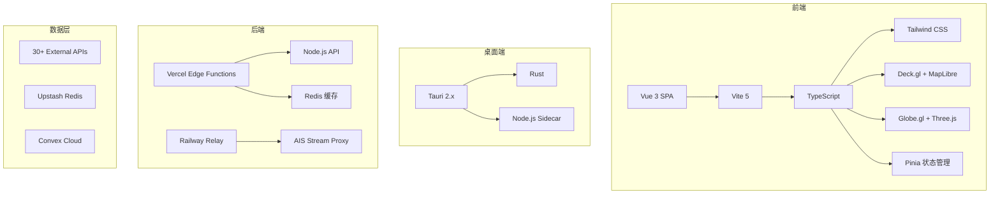
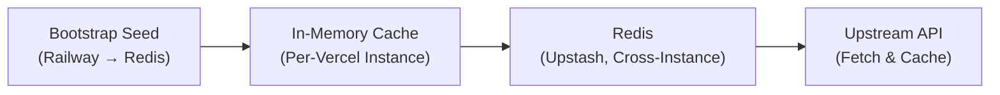
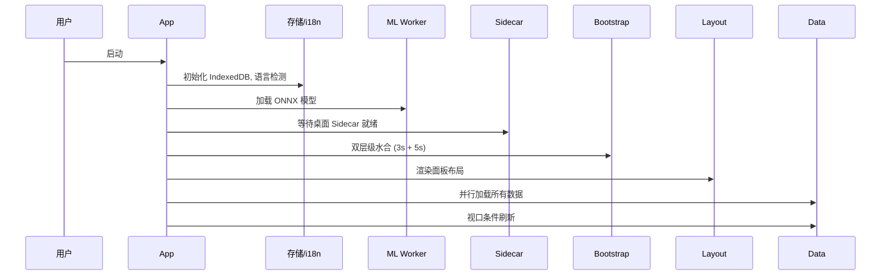
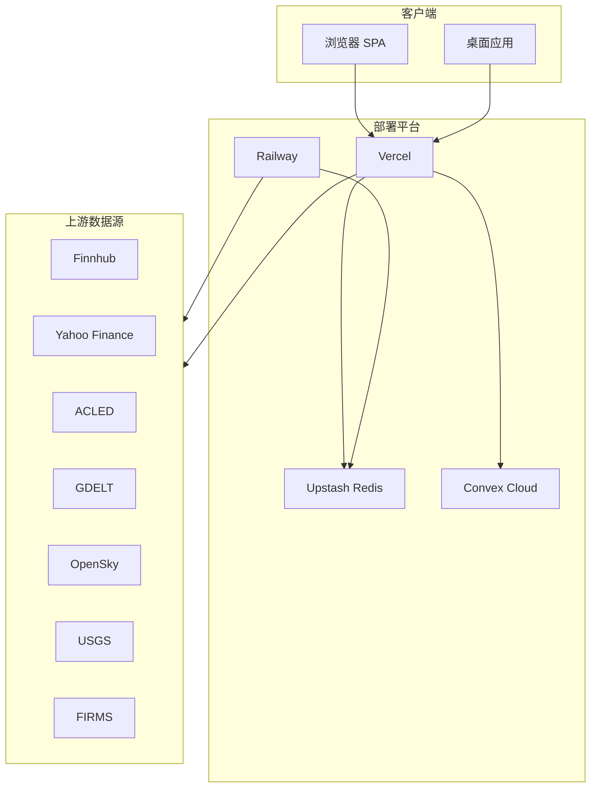
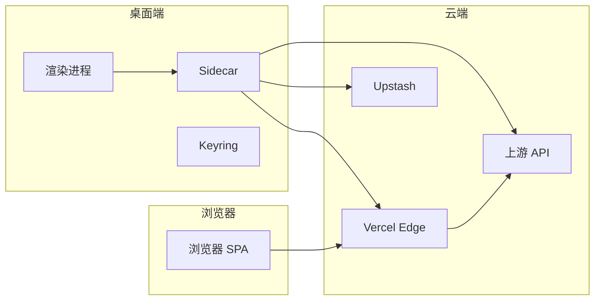

# World Monitor 项目分析报告

> 分析日期：2026-03-25
> 项目版本：v2.6.5
> 文档状态：草稿

---

## 目录

1. [项目概述](#1-项目概述)
2. [技术架构](#2-技术架构)
3. [核心功能模块](#3-核心功能模块)
4. [数据库设计](#4-数据库设计)
5. [API 层设计](#5-api-层设计)
6. [前端架构](#6-前端架构)
7. [部署架构](#7-部署架构)
8. [多语言支持](#8-多语言支持)
9. [变体系统](#9-变体系统)
10. [安全模型](#10-安全模型)
11. [项目特点总结](#11-项目特点总结)

---

## 1. 项目概述

### 1.1 项目定位

World Monitor 是一个**实时全球情报仪表盘**，通过聚合来自多个外部数据源的新闻、军事活动、金融市场、网络威胁、气候事件、海事追踪和航空数据，在交互式地图和专业面板上呈现统一的态势感知。

### 1.2 核心价值主张

- **435+ 精选新闻源**，跨 15 个类别，AI 合成简报
- **双地图引擎** — 3D 地球仪 (globe.gl) 和 WebGL 平面地图 (deck.gl)，45 个数据图层
- **跨流关联** — 军事、经济、灾害和升级信号的收敛分析
- **国家情报指数** — 跨 12 个信号类别的综合风险评分
- **金融雷达** — 92 个股票交易所、大宗商品、加密货币和 7 信号市场综合指数
- **本地 AI** — 支持 Ollama，无需 API 密钥即可运行
- **5 个站点变体** — 单一代码库 (world, tech, finance, commodity, happy)
- **原生桌面应用** (Tauri 2)，支持 macOS、Windows、Linux
- **21 种语言**支持，包含 RTL 语言的本地化

### 1.3 项目统计

| 指标 | 数值 |
|------|------|
| 总文件数 | 700+ TypeScript 文件 |
| Proto 定义 | 200+ Protocol Buffer 文件 |
| 组件数量 | 100+ 面板组件 |
| API 端点 | 22+ 服务域 |
| 语言包 | 21 个翻译文件 |
| 数据源 | 30+ 上游 API |

---

## 2. 技术架构

### 2.1 技术栈总览



### 2.2 前端技术栈

| 类别 | 技术选型 |
|------|----------|
| 框架 | Vue 3 + Composition API |
| 构建 | Vite 5 |
| 语言 | TypeScript 5.7 |
| 样式 | Tailwind CSS + CSS 变量 |
| 状态 | AppContext (中心化可变对象) |
| 路由 | Vue Router 4 |
| 地图 | Mapbox GL JS / MapLibre GL / Deck.gl |
| 3D 地球 | Globe.gl + Three.js |
| 关系图 | D3.js (力导向图) |
| i18n | vue-i18n v9 (21 种语言) |
| HTTP | Axios + EventSource (SSE) |
| AI/ML | Transformers.js + Ollama |
| ORM | Convex (云数据库) |

### 2.3 后端技术栈

| 类别 | 技术选型 |
|------|----------|
| API | Vercel Edge Functions |
| 协议 | Protocol Buffers (sebuf) |
| 缓存 | Upstash Redis |
| 中继 | Railway |
| WebSocket | AISStream 代理 |
| 数据库 | Convex Cloud |
| 认证 | API Key (可配置) |
| 容器化 | Docker + GHCR |

### 2.4 桌面端技术栈

| 类别 | 技术选型 |
|------|----------|
| 框架 | Tauri 2.x |
| 语言 | Rust + Node.js |
| 安全存储 | 平台 Keyring |
| API | 本地 Sidecar 服务 |

---

## 3. 核心功能模块

### 3.1 双地图系统

项目实现了两种地图渲染模式：

#### DeckGLMap (平面地图)
- WebGL 渲染 (deck.gl + maplibre-gl)
- 支持图层类型：
  - `ScatterplotLayer` - 散点
  - `GeoJsonLayer` - GeoJSON 区域
  - `PathLayer` - 路径
  - `IconLayer` - 图标
  - `PolygonLayer` - 多边形
  - `ArcLayer` - 弧线
  - `HeatmapLayer` - 热力图
  - `H3HexagonLayer` - H3 六边形

#### GlobeMap (3D 地球)
- globe.gl + Three.js
- 单个合并的 `htmlElementsData` 数组
- 地球纹理、大气着色器
- 空闲时自动旋转

### 3.2 面板系统

所有面板继承自 `Panel` 基类，使用 `setContent(html)` 渲染（150ms 防抖）。面板支持行列跨距调整，数据持久化到 localStorage。

**主要面板类型：**

| 类别 | 面板示例 |
|------|----------|
| 核心 | 实时新闻、市场、地图 |
| 情报 | GDELT 情报、Telegram 情报 |
| 区域新闻 | 美国、欧洲、中东、非洲、亚太 |
| 市场金融 | 恐惧贪婪指数、ETF 流量、稳定币 |
| 军事 | 战略态势、军用飞机、军用舰艇 |
| 基础设施 | 海底电缆、管道、数据中心 |
| 自然 | 地震、火灾、气候异常 |
| 供应链 | 咽喉要道、航运、矿产 |

### 3.3 信号聚合器

`SignalAggregator` 服务收集所有地图信号并按国家/地区关联，为 AI 洞察提供地理上下文。

**支持的信号类型：**

```typescript
type SignalType =
  | 'internet_outage'      // 互联网中断
  | 'military_flight'       // 军用飞机
  | 'military_vessel'      // 军用舰艇
  | 'protest'             // 抗议活动
  | 'ais_disruption'       // AIS 中断
  | 'satellite_fire'       // 卫星火点
  | 'radiation_anomaly'    // 辐射异常
  | 'temporal_anomaly'     // 时间异常
  | 'sanctions_pressure'   // 制裁压力
  | 'active_strike';      // 活跃打击
```

### 3.4 RSS 新闻采集

`fetchFeed()` 和 `fetchCategoryFeeds()` 处理多语言 RSS 源：

- 支持 RSS/Atom 双格式解析
- 图像提取（media:content、enclosure、HTML 内嵌）
- 关键词威胁分类
- AI 增强分类（可配置）
- 缓存策略（5 分钟冷却）

### 3.5 AI 摘要服务

`SummarizationService` 实现多级降级链：

```
Ollama (本地) → Groq → OpenRouter → Browser T5
```

- 支持新闻摘要和翻译
- 断路器模式防止级联故障
- 持久化缓存（IndexedDB）

---

## 4. 数据库设计

### 4.1 Convex Schema

项目使用 Convex Cloud 存储用户注册和联系表单数据：

```typescript
// convex/schema.ts
export default defineSchema({
  registrations: defineTable({
    email: v.string(),
    normalizedEmail: v.string(),
    registeredAt: v.number(),
    source: v.optional(v.string()),
    appVersion: v.optional(v.string()),
    referralCode: v.optional(v.string()),
    referredBy: v.optional(v.string()),
    referralCount: v.optional(v.number()),
  })
    .index("by_normalized_email", ["normalizedEmail"])
    .index("by_referral_code", ["referralCode"]),

  contactMessages: defineTable({
    name: v.string(),
    email: v.string(),
    organization: v.optional(v.string()),
    phone: v.optional(v.string()),
    message: v.optional(v.string()),
    source: v.string(),
    receivedAt: v.number(),
  }),

  counters: defineTable({
    name: v.string(),
    value: v.number(),
  }).index("by_name", ["name"]),
});
```

### 4.2 缓存架构 (Redis)

采用四级缓存层次：



**缓存策略：**

| 层级 | s-maxage | 使用场景 |
|------|----------|----------|
| fast | 300s | 实时事件流、航班状态 |
| medium | 600s | 市场报价、股票分析 |
| slow | 1800s | ACLED 事件、网络威胁 |
| static | 7200s | 人道主义摘要、ETF 流量 |
| daily | 86400s | 关键矿产、静态参考数据 |
| no-store | 0 | 船舶快照、飞机追踪 |

---

## 5. API 层设计

### 5.1 Protocol Buffer 定义

项目使用 **sebuf** 框架（基于 Protocol Buffers）定义 API 合约：

```
proto/ 定义文件
    ↓ buf generate
src/generated/client/   (TypeScript RPC 客户端存根)
src/generated/server/   (TypeScript 服务端消息类型)
docs/api/               (OpenAPI v3 规范)
```

### 5.2 服务域结构

```
proto/worldmonitor/
├── aviation/v1/           # 航空数据
├── climate/v1/             # 气候数据
├── conflict/v1/           # 冲突事件
├── consumer_prices/v1/     # 消费价格
├── cyber/v1/               # 网络威胁
├── displacement/v1/         # 流离失所
├── economic/v1/           # 经济数据
├── forecast/v1/            # 预测市场
├── giving/v1/              # 捐赠数据
├── imagery/v1/             # 卫星图像
├── infrastructure/v1/      # 基础设施
├── intelligence/v1/        # 情报
├── market/v1/             # 市场数据
├── military/v1/            # 军事数据
├── natural/v1/            # 自然事件
├── news/v1/                # 新闻
├── positive_events/v1/     # 正面事件
├── prediction/v1/          # 预测
├── radiation/v1/          # 辐射
├── research/v1/            # 研究
├── sanctions/v1/           # 制裁
├── seismic/v1/            # 地震
├── supply_chain/v1/       # 供应链
├── trade/v1/              # 贸易
├── thermal/v1/            # 热异常
├── unrest/v1/             # 社会动荡
├── webcam/v1/              # 网络摄像头
└── wildfire/v1/           # 野火
```

### 5.3 网关工厂

`server/gateway.ts` 提供 `createDomainGateway(routes)` 创建域网关，流水线处理：

1. 源检查 (403 禁止)
2. CORS 头
3. OPTIONS 预检
4. API 密钥验证
5. 速率限制
6. 路由匹配
7. POST→GET 兼容
8. 处理器执行 + 错误边界
9. ETag 生成 (FNV-1a)
10. 缓存头应用

### 5.4 核心 API 端点

| 端点 | 方法 | 描述 |
|------|------|------|
| `/api/bootstrap` | GET | 快速/慢速两层级数据水合 |
| `/api/health` | GET | 健康检查和新鲜度状态 |
| `/api/aviation/v1/*` | POST | 航班数据 |
| `/api/conflict/v1/*` | POST | 冲突事件 |
| `/api/military/v1/*` | POST | 军事活动 |
| `/api/news/v1/*` | POST | 新闻聚合 |
| `/api/market/v1/*` | POST | 市场数据 |
| `/api/satellites/v1/*` | POST | 卫星追踪 |

---

## 6. 前端架构

### 6.1 应用初始化

`App.init()` 运行 8 个阶段：



### 6.2 组件结构

```
src/
├── components/          # 100+ 面板组件
│   ├── Panel.ts        # 基类
│   ├── DeckGLMap.ts    # 平面地图
│   ├── GlobeMap.ts     # 3D 地球
│   ├── NewsPanel.ts    # 新闻面板
│   ├── MarketPanel.ts  # 市场面板
│   └── ...
├── services/           # 业务逻辑
│   ├── rss.ts          # RSS 采集
│   ├── signal-aggregator.ts  # 信号聚合
│   ├── summarization.ts # AI 摘要
│   └── ...
├── workers/            # Web Workers
│   ├── ml.worker.ts    # ONNX 推理
│   ├── analysis.worker.ts # 新闻聚类
│   └── vector-db.ts    # 向量数据库
├── config/             # 配置
│   ├── variant-meta.ts # 变体元数据
│   └── map-layer-definitions.ts
└── locales/           # 翻译文件
    ├── zh.json
    ├── en.json
    └── ...
```

### 6.3 状态管理

项目**不使用**外部状态库，采用 **AppContext** 中心化可变对象模式：

```typescript
interface AppContext {
  mapRefs: { deckGL: DeckGLMap | null; globe: GlobeMap | null };
  panels: Map<string, Panel>;
  panelSettings: PanelSettings;
  layerSettings: LayerSettings;
  cachedData: {
    news: NewsItem[];
    markets: MarketData;
    predictions: Prediction[];
    clusters: Cluster[];
    // ...
  };
  inFlightRequests: Set<string>;
  uiComponents: {
    signalModal: SignalModal | null;
    breakingBanner: BreakingNewsBanner | null;
  };
}
```

### 6.4 Web Workers

| Worker | 职责 |
|--------|------|
| `ml.worker.ts` | MiniLM-L6 嵌入、情感分析、摘要、命名实体识别 |
| `analysis.worker.ts` | 新闻聚类（Jaccard 相似度）、跨域关联检测 |
| `vector-db.ts` | IndexedDB 支持的向量存储，语义搜索 |

---

## 7. 部署架构

### 7.1 部署拓扑



### 7.2 服务清单

| 服务 | 平台 | 角色 |
|------|------|------|
| SPA + Edge Functions | Vercel | 静态文件、API 端点、中间件 |
| AIS Relay | Railway | WebSocket 代理、种子循环 |
| Redis | Upstash | 缓存层、防雪崩、速率限制 |
| Convex | Convex Cloud | 联系表单、候补名单 |
| 文档 | Mintlify | 通过 Vercel 代理 |
| 桌面应用 | Tauri 2.x | macOS/Windows/Linux |
| 容器 | GHCR | 多架构 Docker 镜像 |

### 7.3 种子脚本架构

```
scripts/
├── seed-*.mjs              # 独立种子脚本
├── ais-relay.cjs            # AIS 中继服务
├── _seed-utils.mjs          # 共享工具
└── data/                   # 静态数据
```

**AIS Relay 种子循环：**
- 市场数据 (股票、大宗商品、加密、稳定币、ETF、海湾报价)
- 航空 (国际延误)
- 正面事件
- GPSJAM (GPS 干扰)
- 风险评分 (CII)
- UCDP 事件

---

## 8. 多语言支持

### 8.1 i18n 配置

项目支持 **21 种语言**，包括 RTL 支持：

```
src/locales/
├── ar.json     # 阿拉伯语 (RTL)
├── bg.json     # 保加利亚语
├── cs.json     # 捷克语
├── de.json     # 德语
├── el.json     # 希腊语
├── en.json     # 英语
├── es.json     # 西班牙语
├── fr.json     # 法语
├── it.json     # 意大利语
├── ja.json     # 日语
├── ko.json     # 韩语
├── nl.json     # 荷兰语
├── pl.json     # 波兰语
├── pt.json     # 葡萄牙语
├── ro.json     # 罗马尼亚语
├── ru.json     # 俄语
├── sv.json     # 瑞典语
├── th.json     # 泰语
├── tr.json     # 土耳其语
├── vi.json     # 越南语
└── zh.json     # 中文
```

### 8.2 RTL 支持

阿拉伯语支持动态 `dir="rtl"` 切换：

```typescript
// 检测和切换
function setDirection(lang: string) {
  const isRTL = ['ar', 'he', 'fa'].includes(lang);
  document.documentElement.dir = isRTL ? 'rtl' : 'ltr';
}
```

---

## 9. 变体系统

### 9.1 变体定义

项目通过单一代码库支持 **5 个站点变体**：

| 变体 | 域名 | 主题 |
|------|------|------|
| `full` | worldmonitor.app | 全球情报 |
| `tech` | tech.worldmonitor.app | 科技行业 |
| `finance` | finance.worldmonitor.app | 金融市场 |
| `commodity` | commodity.worldmonitor.app | 大宗商品 |
| `happy` | happy.worldmonitor.app | 正面新闻 |

### 9.2 变体元数据

```typescript
export const VARIANT_META: { full: VariantMeta; [k: string]: VariantMeta } = {
  full: {
    title: 'World Monitor - Real-Time Global Intelligence Dashboard',
    description: 'Real-time global intelligence dashboard with live news...',
    url: 'https://www.worldmonitor.app/',
    siteName: 'World Monitor',
    categories: ['news', 'productivity'],
    features: [
      'Real-time news aggregation',
      'Stock market tracking',
      'Military flight monitoring',
      // ...
    ],
  },
  tech: {
    title: 'Tech Monitor - Real-Time AI & Tech Industry Dashboard',
    // ...
  },
  happy: {
    title: 'Happy Monitor - Good News & Global Progress',
    // ...
  },
  // ...
};
```

### 9.3 变体差异

| 功能 | full | tech | finance | commodity | happy |
|------|------|------|---------|-----------|-------|
| 默认面板 | 新闻/地图 | 科技新闻 | 市场数据 | 大宗商品 | 正面新闻 |
| 地图图层 | 军事/冲突 | 科技生态 | 金融中心 | 供应链 | 保护区 |
| 刷新间隔 | 5 分钟 | 10 分钟 | 1 分钟 | 15 分钟 | 30 分钟 |

---

## 10. 安全模型

### 10.1 信任边界



### 10.2 内容安全策略

CSP 源需要三处同步：

1. `index.html` `<meta>` 标签 (开发环境)
2. `vercel.json` HTTP 头 (生产环境)
3. `src-tauri/tauri.conf.json` (桌面端)

### 10.3 认证机制

- **非浏览器来源**：需要 API 密钥
- **受信任浏览器来源**：豁免（生产域名、Vercel 预览、localhost）
- **高级 RPC 路径**：始终需要密钥

### 10.4 速率限制

- 基于 Upstash 滑动窗口
- 每个端点独立限制
- 全局降级限制

### 10.5 密钥管理

- 桌面端：存储在平台 Keyring (macOS Keychain / Windows Credential Manager)
- 通过 Tauri IPC 注入 Sidecar 环境变量
- 作用域限定为白名单环境变量

---

## 11. 项目特点总结

### 11.1 技术亮点

| 特点 | 描述 |
|------|------|
| **Protocol Buffer API** | 使用 sebuf 框架定义类型安全 API，跨前后端共享 |
| **四级缓存架构** | Bootstrap → 内存 → Redis → 上游，防雪崩设计 |
| **双地图引擎** | 平面 (Deck.gl) 和 3D 地球 (Globe.gl) 自由切换 |
| **Web Worker 计算** | ML 推理、新闻聚类在 Worker 中执行，不阻塞主线程 |
| **变体系统** | 单一代码库支持 5 个不同定位的站点 |
| **21 种语言** | 完整 i18n + RTL 支持 |
| **多平台部署** | Web (Vercel)、桌面 (Tauri)、容器 (Docker) |

### 11.2 工程实践

| 实践 | 描述 |
|------|------|
| **TypeScript 严格模式** | `strict: true`，`noUnusedLocals/Parameters` |
| **预推送钩子** | TypeScript 检查、CJS 语法、ESBuild 打包 |
| **Proto 代码生成检查** | CI 验证生成的代码与提交的代码一致 |
| **视觉回归测试** | Playwright + 金色截图对比 |
| **E2E 测试覆盖** | 主题切换、关键词流、移动端交互 |

### 11.3 架构优势

1. **高性能**：Edge Functions + Redis 缓存，毫秒级响应
2. **可扩展**：微服务架构，Proto 定义易于扩展
3. **多租户**：变体系统支持差异化部署
4. **离线能力**：桌面端支持本地密钥管理和离线地图
5. **开发者友好**：完整的类型系统 + 热重载开发环境

### 11.4 与 OSINT Intel Hub 的关系

根据 PRD v2.0 描述，OSINT Intel Hub 项目将参考 World Monitor 的：

- **CRUCIX 风格暗色界面**
- **图层管理系统**（地图图层叠加）
- **信号仪表盘**设计
- **地图集成**方式

World Monitor 作为一个成熟的参考实现，提供了：
- 完整的图层管理 API
- 信号聚合器架构
- 面板组件系统
- 多语言支持方案
- 桌面端集成模式

---

## 附录 A：关键文件路径

```
worldmonitor/
├── package.json                    # 项目配置
├── vite.config.ts                 # Vite 构建配置
├── tsconfig.json                   # TypeScript 配置
├── vercel.json                     # Vercel 部署配置
├── ARCHITECTURE.md                 # 架构文档
│
├── src/                           # 前端源代码
│   ├── main.ts                    # 入口文件
│   ├── App.ts                     # 主应用
│   ├── components/                 # 100+ 面板组件
│   ├── services/                   # 业务逻辑服务
│   ├── workers/                    # Web Workers
│   ├── locales/                    # 翻译文件
│   └── config/                    # 配置
│
├── api/                           # Vercel Edge Functions
│   └── <domain>/v1/[rpc].ts       # RPC 端点
│
├── server/                        # 服务器端代码
│   ├── gateway.ts                  # 网关工厂
│   ├── router.ts                  # 路由匹配
│   ├── _shared/                    # 共享工具
│   └── worldmonitor/              # 域处理器
│
├── proto/                         # Protocol Buffer 定义
│   └── worldmonitor/              # 服务定义
│
├── src-tauri/                     # Tauri 桌面端
│   ├── tauri.conf.json           # Tauri 配置
│   ├── Cargo.toml                 # Rust 依赖
│   └── sidecar/                   # Node.js Sidecar
│
├── convex/                        # Convex 云数据库
│   └── schema.ts                 # 数据模型
│
└── scripts/                       # 种子脚本
    ├── seed-*.mjs                # 独立种子
    └── ais-relay.cjs             # AIS 中继
```

---

## 附录 B：数据源清单

| 数据源 | 类型 | 用途 |
|--------|------|------|
| GDELT | 全球事件 | 冲突监测 |
| ACLED | 武装冲突 | 抗议追踪 |
| UCDP | 冲突事件 | 死亡人数统计 |
| OpenSky | ADS-B | 军用飞机追踪 |
| AISStream | 船舶追踪 | 海军舰艇 |
| USGS | 地震数据 | 实时地震 |
| NASA FIRMS | 野火 | 卫星火点 |
| CoinGecko | 加密货币 | 价格数据 |
| Yahoo Finance | 股票 | 市场数据 |
| Polymarket | 预测市场 | 概率预测 |

---

*文档生成完成*
