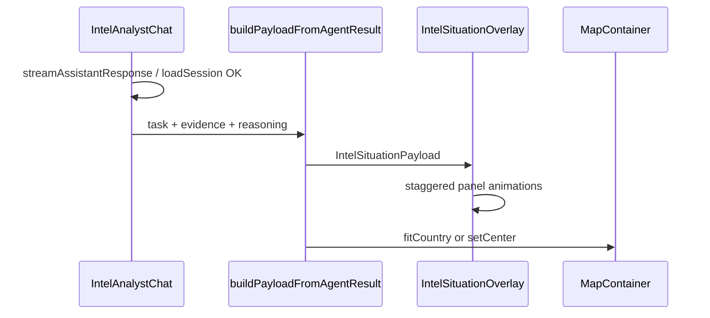

# 全球态势地图与情报面板实现方案

## 现状与可复用能力

- 布局：[`panel-layout.ts`](d:\project\Crucix\code\worldmonitor\src\app\panel-layout.ts) 中 `#intelAnalystSidebar` 与 `.map-section` / `#mapContainer` 已并排；地图顶栏已有 UTC 时钟、`2D`/`3D`、全屏、图钉（与截图接近）。标题目前为通用 `t('panels.map')`，可按需改为情报语境下的「全球态势」（例如给 `#mapSection` 加 modifier class 仅在 Intel Hub 流程下切换文案）。
- 对话结果：[`IntelAnalystChat.ts`](d:\project\Crucix\code\worldmonitor\src\components\IntelAnalyst\IntelAnalystChat.ts) 在 `streamAssistantResponse` / `loadSession` 成功后会得到 `AgentTaskResult` 并生成 `IntelReportBlock`（含 `targetName`、按 evidence 分类聚合的 `sections`、推理里的 `probability.primary/secondary/tertiary.location`）。
- 地图 API：[`MapContainer`](d:\project\Crucix\code\worldmonitor\src\components\MapContainer.ts) 已暴露 `setCenter(lat, lon, zoom?)` 与 `fitCountry(code)`，内部 [`DeckGLMap`](d:\project\Crucix\code\worldmonitor\src\components\DeckGLMap.ts) 使用 `maplibreMap.flyTo` / `fitBounds`（已有动画时长）。
- 数据缺口：`Person.nationality` 在 [`person.py`](d:\project\Crucix\server\backend\app\models\person.py) 存在，但 [`AgentTaskOut`](d:\project\Crucix\server\backend\app\schemas\agent.py) 未返回国籍或 ISO 国家码；仅靠前端把中文地名/国籍猜成 ISO2 易错，**建议后端补充字段**。

## 架构（模块化新目录）

新建目录（建议）：[`code/worldmonitor/src/components/IntelSituation/`](d:\project\Crucix\code\worldmonitor\src\components\IntelSituation)

| 文件 | 职责 |

|------|------|

| `types.ts` | `IntelSituationPayload`：人物名、各面板 HTML/纯文本槽位、面板可用状态、`countryCode?: string`、`markers?: { origin, target }` 等 |

| `buildPayloadFromAgentResult.ts` | 将 `AgentTaskResult` + 现有 `buildIntelReportFromRaw` 逻辑能拿到的分类，映射到 6 个面板（见下） |

| `IntelSituationOverlay.ts` | 在 `.map-section` 内创建绝对定位包裹层（覆盖在 `#mapContainer` 之上），渲染面板 DOM、绑定右上角状态角标、侧栏菜单占位；提供 `update(payload)`、`clear()` |

| `IntelSituationOverlay.css` | 半透明情报风、红靶点/青线若用纯 CSS 动画可放此处；面板进场动画（`@keyframes`：位移 + 透明度 + 可选扫描线 `::after`），用 `animation-delay` 做左右列错峰 |

| `nationalityFallback.ts`（可选） | 仅在后端未给 `country_code` 时，将常见中/英文国籍字符串映射到 ISO2，调用 `fitCountry` |

**尽量不扩散改动**：核心业务逻辑与样式集中在此文件夹；对外只暴露 1～2 个类型 + `IntelSituationOverlay` + `buildPayloadFromAgentResult`。

## 数据流

## 面板与证据分类映射（对齐截图）

与 [`EvidenceItemOut.category`](d:\project\Crucix\code\worldmonitor\src\services\chat\index.ts) 对应关系建议固定为：

- **公开媒体信息** ← `public_media`
- **社交平台信息** ← `social_media`
- **所用 APP 信息** ← `app_info`
- **AI 洞察 · 人物关系** ← `relationship`（或关系类摘要）
- **潜在信息** ← `other` 或推理结论摘要
- **个人资料** ← `task.person_name` + `task.summary` / 首条档案类 evidence（若后端后续有 profile 字段再替换）

面板右上角「不可用」：当该槽位无内容或 `confidence` 全低时显示；有内容时改为「已加载」或隐藏角标（按产品规范定枚举）。

## 地图定位策略

1. **首选**：后端在 `AgentTaskOut`（或单独嵌套 `person_geo`）中返回 `primary_country_code`（ISO 3166-1 alpha-2），由 pipeline 从 `Person.nationality` 规范化或从推理主位置解析得到。前端 `MapContainer.fitCountry(code)`。
2. **次选**：若无国家码，用推理步骤 `probability.primary.location` 等字符串，在前端做**有限**别名表 + 可选调用已有地理工具（若项目内已有 geocode 服务则复用；否则避免引入在线 API 依赖，先国家/大区级别）。
3. **台湾等特殊区域**：与数据约定一致（存 `TW` 或具体坐标）；`getCountryBbox` 已在 DeckGL 侧使用，需与业务表述一致。

## 地图上的靶标与连线（与截图一致）

截图中的橙点、红点脉冲、浅蓝射线属于**地图内图层**，纯 HTML 面板无法随地图拖拽缩放对齐。

- **推荐实现**：在 [`DeckGLMap.ts`](d:\project\Crucix\code\worldmonitor\src\components\DeckGLMap.ts) 增加小型 API，例如 `setIntelScenarioGeo({ lines: [[lon,lat]...], points: [...] }) `/ `clearIntelScenarioGeo()`，内部用 MapLibre 的 `GeoJSON` source + `line` + `circle` 图层（或项目已有的 deck `ArcLayer` 模式，二选一保持风格统一）。再由 [`MapContainer`](d:\project\Crucix\code\worldmonitor\src\components\MapContainer.ts) 转发，供 `IntelSituationOverlay` 的协调器调用。
- **降级**：第一迭代可只做 `fitCountry` + 面板动画，暂缓矢量图层；后续再接 Geo。

**坐标来源**：需后端或前端能把「地点名称」解析为经纬度；若短期只有国家码，则可将 target 设为国家中心点 + origin 设为邻近海域预设点（演示用，需在代码注释中标明为占位）。

## 与现有代码的衔接点（最小侵入）

1. **扩展** `IntelAnalystChatResizeConfig`（同文件内）：增加可选 `onSituationUpdate?: (payload: IntelSituationPayload | null) => void`。在 `streamAssistantResponse` 成功、`loadSession` 成功、`handleNewChat` 时分别调用（新会话传 `null` 以清除覆盖层与地图临时图层）。
2. **[`panel-layout.ts`](d:\project\Crucix\code\worldmonitor\src\app\panel-layout.ts)**：`createPanels` 在 `MapContainer` 创建之后，实例化 `IntelSituationOverlay`（挂载到 `mapSection`），并把 `onSituationUpdate` 传给 `IntelAnalystChat`，在回调里：

   - `overlay.update(payload)`
   - `ctx.map.fitCountry` / `setCenter` /（可选）`setIntelScenarioGeo`

3. **类型**：[`src/types/intel-chat.ts`](d:\project\Crucix\code\worldmonitor\src\types\intel-chat.ts) 可选择性导出/引用 `IntelSituationPayload`（或保持 payload 仅在 `IntelSituation` 包内，由 chat 仅依赖回调类型别名）。

## 后端小改（强烈建议）

- 在 [`AgentTaskOut`](d:\project\Crucix\server\backend\app\schemas\agent.py) 增加可选字段：`person_nationality: str | None`、`primary_country_code: str | None`（或 `person: { nationality, country_code }`）。
- 在 [`agent.py`](d:\project\Crucix\server\backend\app\routers\agent.py) 返回前 `refresh` 关联 `Person` 并填充；`country_code` 可由简单映射表或后续接规范化服务。
- 同步更新前端 [`AgentTaskOut` 接口](d:\project\Crucix\code\worldmonitor\src\services\chat\index.ts) 与 `buildPayloadFromAgentResult` 读取逻辑。

## 验收要点

- 左侧一次分析完成后，右侧 6 面板带错峰进场动画，风格与现有暗色情报 UI 一致（可复用 [`IntelAnalystChat.css`](d:\project\Crucix\code\worldmonitor\src\components\IntelAnalyst\IntelAnalystChat.css) 中的色板变量若已定义 CSS 变量）。
- 地图平滑飞转到人物国家（2D Deck 与 3D Globe 均通过现有 `fitCountry` 路径）。
- 新开对话时清除面板内容与地图临时图层，避免串任务。
- 新功能代码主要位于 `IntelSituation/` + 少量 `panel-layout` / `IntelAnalystChat` /（可选）`MapContainer`/`DeckGLMap` / 后端 schema。