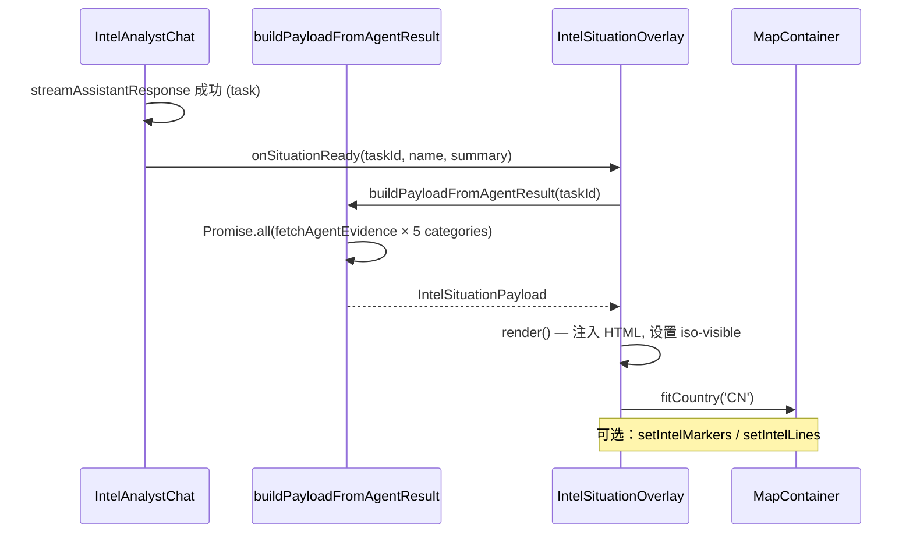

# 全球态势地图叠加层实现方案

## 约束

- 使用现有 `GET /api/agent/{task_id}/evidence?category=...` 接口获取证据（无后端改动）
- 地图定位默认设为中国（`CN`），不做国家码推断
- 不改后端

---

## 步骤 1 — 创建类型与 Payload 构建器

**新建：** `code/worldmonitor/src/components/IntelSituation/types.ts`

定义 `IntelSituationPayload`，包含 6 个面板槽位（每个含 title/HTML/available）和地图标记配置：

```typescript
// src/components/IntelSituation/types.ts
export interface PanelSlot {
  title: string
  html: string          // 纯 HTML 片段
  available: boolean     // 无内容时 false，右上角显示"不可用"
}

export interface IntelSituationPayload {
  targetName: string
  reportId: string
  /** 面板按固定顺序索引: 0=公开媒体, 1=社交平台, 2=APP信息, 3=AI洞察·人物关系, 4=潜在信息, 5=个人资料 */
  panels: PanelSlot[]
  /** 地图定位：默认 CN */
  countryCode: string
  /** 可选：地图上的脉冲点坐标 [{lon, lat, label}] */
  markers?: Array<{ lon: number; lat: number; label?: string }>
  /** 可选：连线 [from, to] */
  lines?: Array<{ from: [number, number]; to: [number, number]; label?: string }>
}
```

**新建：** `code/worldmonitor/src/components/IntelSituation/buildPayloadFromAgentResult.ts`

```typescript
// src/components/IntelSituation/buildPayloadFromAgentResult.ts
import { fetchAgentEvidence } from '@/services/chat'

const PANEL_CATEGORIES = [
  'public_media',    // index 0
  'social_media',    // index 1
  'app_info',        // index 2
  'relationship',    // index 3
  'other',           // index 4
  'profile',         // index 5 — fallback: task.person_name + summary
]

export async function buildPayloadFromAgentResult(
  taskId: string,
  taskName: string,
  taskSummary?: string,
): Promise<IntelSituationPayload> {
  const [pub, social, app, rel, other] = await Promise.all([
    fetchAgentEvidence(taskId, 'public_media').catch(() => []),
    fetchAgentEvidence(taskId, 'social_media').catch(() => []),
    fetchAgentEvidence(taskId, 'app_info').catch(() => []),
    fetchAgentEvidence(taskId, 'relationship').catch(() => []),
    fetchAgentEvidence(taskId, 'other').catch(() => []),
  ])

  const panels: PanelSlot[] = [
    { title: '公开媒体信息', html: buildSectionHtml(pub), available: pub.length > 0 },
    { title: '社交平台信息', html: buildSectionHtml(social), available: social.length > 0 },
    { title: '所用 APP 信息', html: buildSectionHtml(app), available: app.length > 0 },
    { title: 'AI 洞察 · 人物关系', html: buildSectionHtml(rel), available: rel.length > 0 },
    { title: '潜在信息', html: buildSectionHtml(other), available: other.length > 0 },
    {
      title: '个人资料',
      html: taskSummary ?? taskName,
      available: !!(taskSummary || taskName),
    },
  ]

  return {
    targetName: taskName,
    reportId: `ISR-${taskId}`,
    panels,
    countryCode: 'CN',         // 默认中国
    markers: [],
    lines: [],
  }
}

function buildSectionHtml(items: EvidenceItemOut[]): string {
  if (!items.length) return ''
  return items
    .map((item) => `<div class="iso-evidence-item">
      <div class="iso-evidence-title">${escapeHtml(item.title)}</div>
      <div class="iso-evidence-body">${escapeHtml(item.content)}</div>
      ${item.source_platform ? `<div class="iso-evidence-source">${escapeHtml(item.source_platform)}</div>` : ''}
    </div>`)
    .join('')
}
```

---

## 步骤 2 — `IntelSituationOverlay` 核心组件

**新建：** `code/worldmonitor/src/components/IntelSituation/IntelSituationOverlay.ts`

在 `IntelAnalystChat` 所在父容器（`#intelAnalystSidebar` 或新建的 `#mapOverlayWrapper`）内，创建绝对定位叠加层：

```typescript
// src/components/IntelSituation/IntelSituationOverlay.ts
export class IntelSituationOverlay {
  private container: HTMLElement

  constructor(parentEl: HTMLElement) {
    this.container = document.createElement('div')
    this.container.id = 'intelSituationOverlay'
    this.container.className = 'intel-situation-overlay'
    parentEl.appendChild(this.container)
  }

  async update(taskId: string, taskName: string, taskSummary?: string): Promise<void> {
    const payload = await buildPayloadFromAgentResult(taskId, taskName, taskSummary)
    this.render(payload)
    // 触发错峰进场动画
    this.container.classList.add('iso-visible')
  }

  clear(): void {
    this.container.classList.remove('iso-visible')
    this.container.innerHTML = ''
  }

  private render(payload: IntelSituationPayload): void {
    // 两列布局（3+3），每格右上角状态角标
    // 面板 HTML 直接注入 .iso-panel-body
    // 调用 MapContainer.setCenter 飞转到 CN
  }
}
```

接入 MapContainer 飞转到中国：

```typescript
// 在 render() 内
const ctx = window.__crucix_app_ctx  // 或通过 panel-layout.ts 传入 map ref
ctx?.map?.fitCountry(payload.countryCode)
```

---

## 步骤 3 — 样式

**新建：** `code/worldmonitor/src/components/IntelSituation/IntelSituationOverlay.css`

```css
/* 情报暗色风格 — 复用已有 CSS 变量 */
.intel-situation-overlay {
  position: absolute;
  top: 56px;         /* 顶栏高度 */
  left: 0;
  right: 0;
  bottom: 0;
  pointer-events: none;
  display: grid;
  grid-template-columns: 1fr 1fr;
  grid-template-rows: repeat(3, 1fr);
  gap: 8px;
  padding: 8px;
  opacity: 0;
  transition: opacity 0.4s ease;
  z-index: 100;
}

.intel-situation-overlay.iso-visible {
  opacity: 1;
  pointer-events: auto;
}

/* 面板通用样式 */
.iso-panel {
  background: rgba(10, 14, 20, 0.88);
  border: 1px solid rgba(0, 212, 170, 0.3);
  border-radius: 6px;
  overflow: hidden;
  display: flex;
  flex-direction: column;
}

/* 错峰进场动画 — 列间 delay */
.iso-panel {
  animation: iso-slide-in 0.5s cubic-bezier(0.22, 1, 0.36, 1) both;
}
.iso-panel:nth-child(even) { animation-delay: 0.08s; }
.iso-panel:nth-child(3n)   { animation-delay: 0.16s; }
.iso-panel:nth-child(4n)   { animation-delay: 0.04s; }
.iso-panel:nth-child(5n)   { animation-delay: 0.12s; }
.iso-panel:nth-child(6n)   { animation-delay: 0.20s; }

@keyframes iso-slide-in {
  from { opacity: 0; transform: translateY(12px); }
  to   { opacity: 1; transform: translateY(0); }
}

/* 面板头部 */
.iso-panel-header {
  display: flex;
  align-items: center;
  justify-content: space-between;
  padding: 8px 12px;
  border-bottom: 1px solid rgba(0, 212, 170, 0.15);
}
.iso-panel-title { font-size: 12px; font-weight: 600; color: #00d4aa; }

/* 状态角标 */
.iso-status {
  font-size: 10px;
  padding: 2px 6px;
  border-radius: 3px;
}
.iso-status--unavailable {
  background: rgba(255,255,255,0.05);
  color: rgba(255,255,255,0.35);
}
.iso-status--loaded {
  background: rgba(0, 212, 170, 0.15);
  color: #00d4aa;
}

/* 面板内容 */
.iso-panel-body {
  flex: 1;
  overflow-y: auto;
  padding: 8px 12px;
  font-size: 11px;
  color: rgba(255,255,255,0.75);
  line-height: 1.5;
}

.iso-evidence-item { margin-bottom: 8px; }
.iso-evidence-title { font-weight: 600; color: #fff; margin-bottom: 2px; }
.iso-evidence-source { font-size: 10px; color: rgba(255,255,255,0.4); margin-top: 2px; }
```

---

## 步骤 4 — 接入 `IntelAnalystChat` 回调

**修改：** `code/worldmonitor/src/components/IntelAnalyst/IntelAnalystChat.ts`

扩展 `IntelAnalystChatResizeConfig` 接口（第 358 行附近）：

```typescript
// IntelAnalystChat.ts — 新增字段
export type IntelAnalystChatResizeConfig = {
  handleId: string
  containerId: string
  storageKey: string
  isMobile?: boolean
  onVisibilityChange?: (visible: boolean) => void
  /** 新增：情报报告生成完成后回调 */
  onSituationReady?: (taskId: string, taskName: string, taskSummary?: string) => void
  /** 新增：新对话开始时清除回调 */
  onNewChat?: () => void
}
```

在 `streamAssistantResponse`（第 880 行），成功获取 `task` 后调用：

```typescript
// IntelAnalystChat.ts — streamAssistantResponse 内，约第 905 行
if (this.resizeConfig.onSituationReady) {
  this.resizeConfig.onSituationReady(
    String(task.id),
    task.person_name ?? task.command_text.slice(0, 30),
    task.summary,
  )
}
```

在 `loadSession`（第 953 行），成功拉取后同样调用：

```typescript
// IntelAnalystChat.ts — loadSession 内，约第 995 行
if (/^\d+$/.test(sessionId)) {
  const json = await fetchAgentResult(sessionId)
  // ... existing code ...
  if (this.resizeConfig.onSituationReady) {
    this.resizeConfig.onSituationReady(String(task.id), task.person_name ?? task.command_text.slice(0, 30), task.summary)
  }
}
```

在 `handleNewChat`（新建/重置时）调用 `onNewChat` 清除旧数据。

---

## 步骤 5 — `panel-layout.ts` 接入

**修改：** `code/worldmonitor/src/app/panel-layout.ts`

在 `#intelAnalystSidebar` 容器创建后（第 414 行附近），实例化 `IntelSituationOverlay` 并传入 `onSituationReady`：

```typescript
// panel-layout.ts — createPanels() 内
const sidebarEl = document.getElementById('intelAnalystSidebar')

// 态势覆盖层：挂到 #intelAnalystSidebar 或 #mapSection
const situationOverlay = new IntelSituationOverlay(sidebarEl)

this._intelAnalystChat = new IntelAnalystChat(sidebarEl, {
  handleId: 'intelResizeHandle',
  containerId: 'mainContent',
  storageKey: STORAGE_KEYS.sidebarWidth,
  isMobile: this.ctx.isMobile,
  onVisibilityChange: (visible) => { /* existing */ },
  onSituationReady: (taskId, taskName, taskSummary) => {
    situationOverlay.update(taskId, taskName, taskSummary)
    this.ctx.map?.fitCountry('CN')   // 默认中国
  },
  onNewChat: () => {
    situationOverlay.clear()
  },
})
```

**注意：** 叠加层应挂到 `#intelAnalystSidebar` 或 `#mapSection`，并设为 `pointer-events: none` 基础状态，只在 `iso-visible` 时接收交互。

---

## 步骤 6 — 地图靶标与连线（可选降级实现）

**修改：** `code/worldmonitor/src/components/DeckGLMap.ts`

在 `buildLayers()`（第 1348 行附近）末尾添加新方法：

```typescript
private createIntelMarkersLayer(): ScatterplotLayer | null {
  if (!this.intelMarkers?.length) return null
  return new ScatterplotLayer({
    id: 'intel-markers',
    data: this.intelMarkers,
    getPosition: (d) => [d.lon, d.lat],
    getRadius: 40000,
    getFillColor: [255, 100, 0, 220],  // 橙红靶点
    stroked: true,
    getLineColor: [0, 212, 170, 255],
    lineWidthMinPixels: 1,
    radiusMinPixels: 6,
    radiusMaxPixels: 20,
  })
}
```

`public setIntelMarkers(markers)` 方法在 `DeckGLMap` 中暴露，委托自 `MapContainer`。

`IntelSituationOverlay.render()` 调用 `ctx.map.setIntelMarkers(payload.markers)`。

---

## 数据流图



---

## 验收要点

- 左侧一次分析完成后，右侧叠加层 6 面板带错峰动画出现
- 地图飞转到中国（`CN`），`MapContainer.fitCountry` 路径已有
- 新对话/切换 session 时 `situationOverlay.clear()` 清除旧内容
- 情报暗色风格与现有 `IntelAnalystChat.css` 变量保持一致
- 全部新代码集中于 `components/IntelSituation/` 目录
